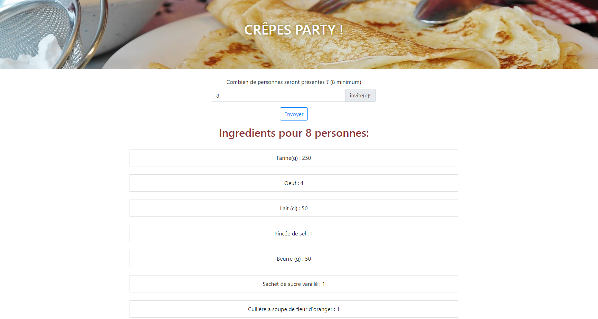

# Atelier révision en autonomie

## Exercice réalisée au cours de ma formation chez O'Clock

Cet exercice a été réalisé dans le but de m'exercer à utiliser les fonctions PHP, les boucles et les conditions lorsque nous apprenions le langage. 
Le but était d'afficher une recette de pâte à crêpes en fonction du nombre de personnes entré dans l'input. 
J'ai également rajouté, en plus des consignes, un peu de CSS avec Bootstrap.

